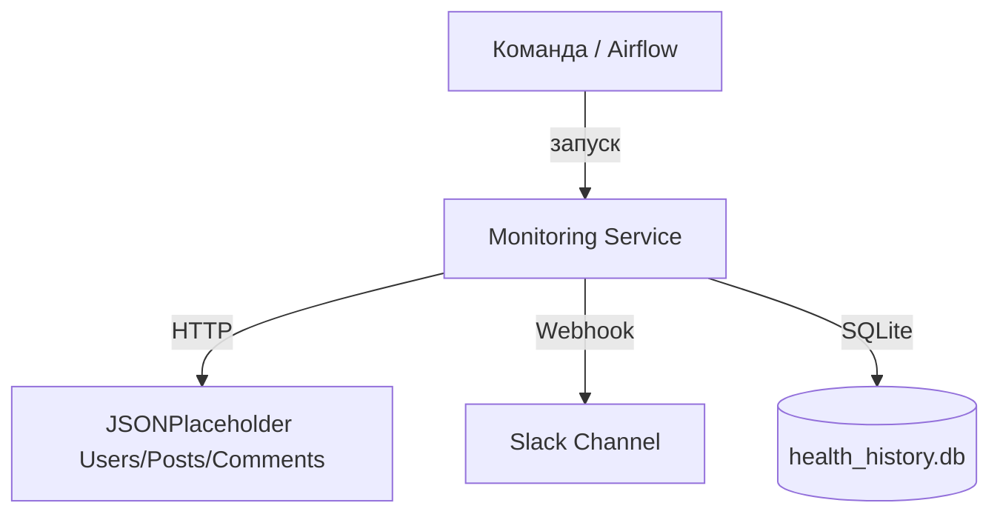
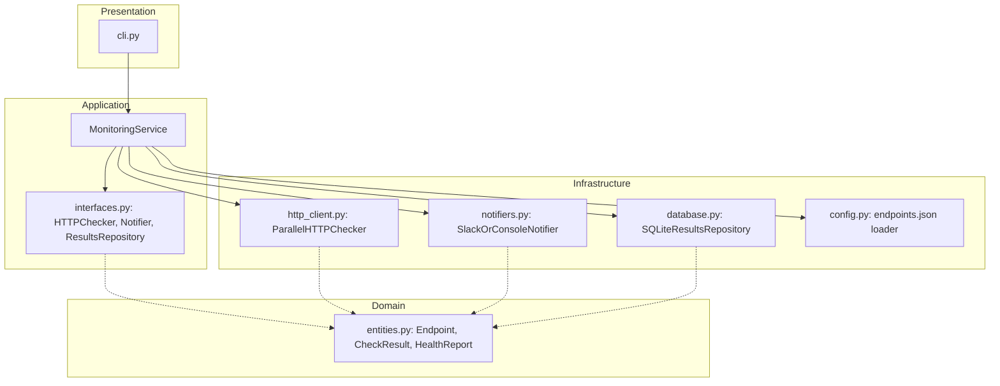

# C4-модель: Мониторинг внешних API

## Контекст (C1)


## Контейнеры (C2)
```mermaid
graph TD
  subgraph Host[Хост / Docker контейнер]
    CLI[CLI (monitor.py)]
    App[Application Service]
    Checker[HTTP Checker (ThreadPool)]
    Notifier[Notifier (Slack/Console)]
    Repo[SQLite Repository]
    File[health_report.json]
  end

  CLI --> App
  App --> Checker
  App --> Notifier
  App --> Repo
  App --> File
```

## Компоненты (C3)


## Замечания
- Зависимости направлены внутрь: Application зависит от абстракций, а не реализаций.
- Компоненты можно подменять (например, TelegramNotifier, PostgresRepo) без изменения бизнес-логики.

