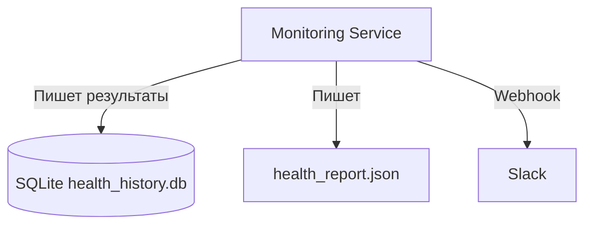
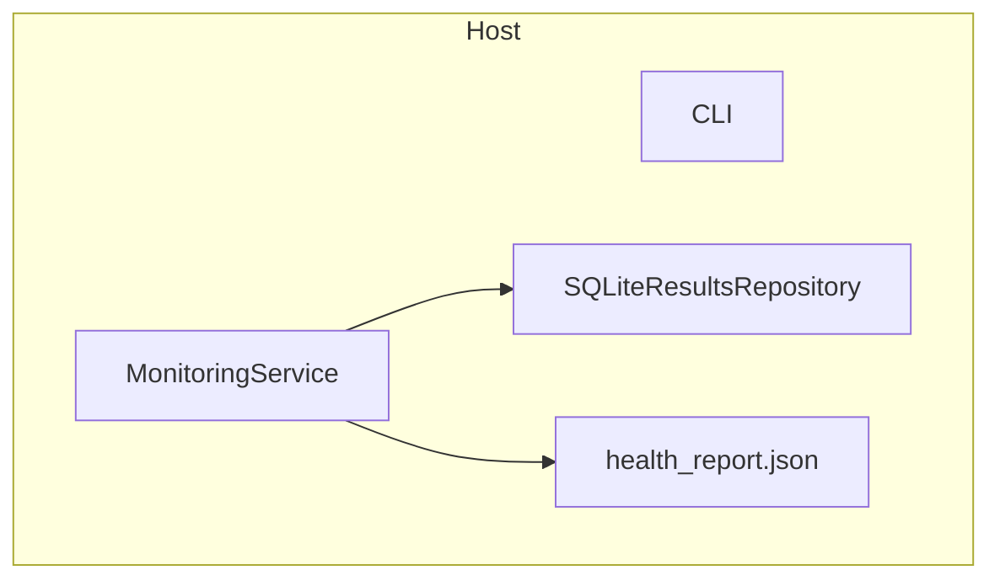
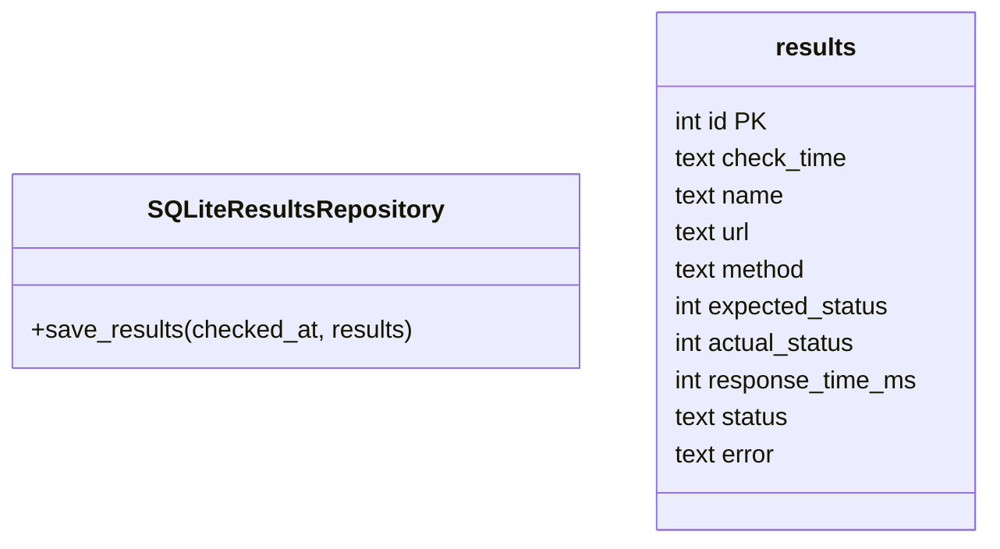

# C4-модель (углубление): Хранилище и потоки данных

## Контекст

## Контейнеры

## Компоненты и схемы таблиц

## Поток
1. MonitoringService собирает результаты проверок.
2. Сохраняет пачкой в таблицу results.
3. Пишет агрегированный health_report.json для операторов/CI.
4. Отправляет уведомление в Slack/консоль.

## Наблюдения
- SQLite выбран как легковесный журнал. При росте можно заменить на Postgres, реализовав другой ResultsRepository.
- Чтения из БД для принятия решений легко добавить, не затрагивая основной сервис.

